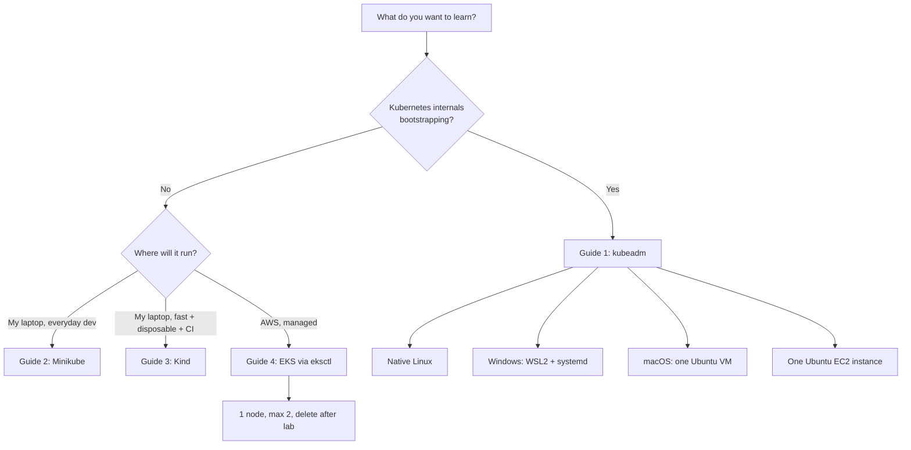

# Single-Node Kubernetes Cluster Setup Handbook

Four independent, beginner-friendly guides for running **one** Kubernetes cluster with **one node** (plus a small Amazon EKS cluster capped at two worker nodes).

Every guide is self-contained. You never need to read another guide to finish the one you picked.

| Guide | Tool | Where it runs |
|-------|------|---------------|
| [Guide 1 — kubeadm](./kubeadm/) | `kubeadm` + `containerd` | Native Linux · WSL2 · Ubuntu VM on macOS · one Ubuntu EC2 instance |
| [Guide 2 — Minikube](./minikube/) | `minikube` | Windows · WSL2 · Linux · macOS (Intel + Apple Silicon) · one Ubuntu EC2 instance |
| [Guide 3 — Kind](./kind/) | `kind` | Windows · WSL2 · Linux · macOS (Intel + Apple Silicon) · one Ubuntu EC2 instance |
| [Guide 4 — Amazon EKS](./eksctl/) | `eksctl` | AWS — 1 worker node, maximum 2 |

---

## 1. What this handbook does and does not build

**It builds:**

- A single-node cluster where the same machine (or the same container) is control plane **and** worker.
- A small managed EKS cluster with one managed node group, desired capacity `1`, maximum `2`.

**It does not build:**

- A multi-machine local lab.
- A kubeadm cluster with a separate worker machine.
- A three-node local cluster.
- An EKS cluster with more than two worker nodes.
- A NAT Gateway in the basic EKS lab.

---

## 2. Three environments, clearly separated

### Local laptop setup

Kubernetes runs on your own machine:

- **Windows** — through WSL2 (kubeadm), or natively through Docker Desktop (Minikube, Kind).
- **Linux** — directly on the host.
- **macOS** — through Docker Desktop, Colima, a Minikube driver, or a Linux virtual machine (kubeadm requires the VM).

Cost: free. Limits: your laptop's CPU, memory, and battery.

### Single EC2 instance setup

The whole cluster runs on **one** Ubuntu EC2 instance. That single instance is simultaneously:

- Kubernetes control-plane node
- Kubernetes worker node
- Container runtime host
- Application workload node

Cost: whatever that one instance plus its EBS volume costs, billed per second while running.

### Amazon EKS setup

AWS runs and bills the control plane. You run the worker nodes:

- One managed worker node by default
- Maximum two managed worker nodes
- No larger node groups
- No NAT Gateway in the basic learning architecture
- Cost-focused configuration, deleted at the end of the lab

---

## 3. Platform limitations you must know before choosing

> [!IMPORTANT]
> These are hard constraints, not preferences.

- **kubeadm requires Linux.** It manages Linux system services (`kubelet` via systemd) and Linux kernel features (cgroups, netfilter, overlay).
- **kubeadm cannot run directly on native Windows.** There is no native Windows `kubeadm` control plane.
- **kubeadm cannot run directly on native macOS.** macOS has no cgroups, no systemd, and no Linux netfilter.
- **Windows users** who want kubeadm should use WSL2 with systemd enabled, a local Ubuntu VM, or an Ubuntu EC2 instance.
- **macOS users** who want kubeadm should run it inside one Ubuntu virtual machine.
- **Minikube and Kind are the better options** for native Windows and native macOS development.
- **WSL2 must have systemd enabled** for any setup that depends on Linux services (kubeadm definitely; Docker-in-WSL usually).
- **WSL1 is not supported** for any guide here. Use WSL2.
- **Docker Desktop's built-in Kubernetes is not kubeadm, Kind, or Minikube.** It is a separate, opinionated single-node cluster with its own lifecycle. This handbook does not use it, and leaving it enabled can create `kubectl` context confusion — see each guide's troubleshooting page.

---

## 4. Versions used to validate this handbook

Validated on **2026-08-05**. Newer patch releases normally work unchanged; substitute the current version where a guide uses a placeholder.

| Component | Version used | Notes |
|-----------|--------------|-------|
| Kubernetes | **1.36** | Latest stable minor at time of writing; 1.37 is due late August 2026 |
| Ubuntu | **24.04 LTS** | Also fine on 22.04 LTS |
| containerd | **2.3.x** (`containerd.io` from the Docker apt repo) | CRI plugin enabled, `SystemdCgroup = true` |
| Calico | **v3.32.1** | Primary CNI for the kubeadm guide |
| Cilium | **1.20.x** | Documented alternative CNI |
| Minikube | **v1.38.1** | |
| Kind | **v0.32.0** | Default node image `kindest/node:v1.36.1` |
| ingress-nginx controller | **v1.15.1** | Kind provider manifest |
| eksctl | **v0.229.0** | |
| EKS Kubernetes version | **1.36** | 1.35 and 1.34 also supported at time of writing |
| Sample app image | `nginx:1.30-alpine` | multi-arch: `amd64` + `arm64` |

> [!WARNING]
> Do **not** use the old `apt.kubernetes.io` / `packages.cloud.google.com/apt` Kubernetes repositories. They were retired and are no longer served. Every guide here uses **`pkgs.k8s.io`**, which is versioned per minor release (`.../core:/stable:/v1.36/deb/`).

---

## 5. Comparison table

| Feature | Single-Node kubeadm | Single-Node Minikube | Single-Node Kind | Small EKS |
|---|---|---|---|---|
| Laptop support | Linux only (VM/WSL2 elsewhere) | Yes | Yes | N/A — cloud |
| Windows native support | ❌ No | ✅ Yes (Docker Desktop / Hyper-V) | ✅ Yes (Docker Desktop) | ✅ CLI only |
| WSL2 support | ✅ Yes (systemd required) | ✅ Yes | ✅ Yes | ✅ CLI only |
| Linux support | ✅ Yes (native) | ✅ Yes | ✅ Yes | ✅ CLI only |
| macOS support | ⚠️ Ubuntu VM only | ✅ Yes (Docker/Colima/QEMU) | ✅ Yes (Docker/Colima) | ✅ CLI only |
| One EC2 instance support | ✅ Yes | ✅ Yes (Docker driver) | ✅ Yes | N/A — managed |
| Nodes in main setup | 1 | 1 | 1 | 1, maximum 2 |
| Production suitability | ✅ Real production tool (multi-node) | ❌ No | ❌ No | ✅ Yes |
| Learning control-plane internals | ⭐ Best — you build it | Low | Low | Low — AWS hides it |
| Ease of installation | Hard (~25 steps) | Easy (1 command) | Easy (1 command) | Medium (1 command + AWS setup) |
| Docker dependency | ❌ None (uses containerd) | Optional (Docker is the default driver) | ✅ Required | ❌ None locally |
| Cloud cost | Free locally / EC2 cost | Free locally / EC2 cost | Free locally / EC2 cost | 💰 Control plane + nodes, hourly |
| Startup time | 5–15 min | 2–4 min | 30–60 s | 12–20 min |
| CI/CD suitability | Poor | Fair | ⭐ Best | Poor (slow, costly) |
| Cleanup complexity | High (`kubeadm reset` + network cleanup) | Low (`minikube delete`) | Very low (`kind delete cluster`) | High (cost risk if incomplete) |

---

## 6. Decision guide

```text
Do you want to learn how Kubernetes is bootstrapped internally?
├── Yes
│   └── Use single-node kubeadm on Linux, WSL2, an Ubuntu VM, or one EC2 instance
└── No
    ├── Want an easy local development cluster?
    │   └── Use Minikube
    ├── Want a lightweight Docker-based test cluster?
    │   └── Use Kind
    └── Want managed Kubernetes on AWS?
        └── Use EKS with one worker node and a maximum of two
```



---

## 7. Repository structure

```text
kubernetes-cluster-setup/
├── README.md                  ← you are here
├── kubeadm/
│   ├── README.md
│   ├── local-linux.md
│   ├── wsl2.md
│   ├── macos-ubuntu-vm.md
│   ├── single-ec2.md
│   ├── manifests/
│   │   ├── 00-namespace.yaml
│   │   ├── 10-deployment.yaml
│   │   ├── 20-service-clusterip.yaml
│   │   └── 30-service-nodeport.yaml
│   └── troubleshooting.md
├── minikube/
│   ├── README.md
│   ├── windows.md
│   ├── wsl2.md
│   ├── linux.md
│   ├── macos.md
│   ├── single-ec2.md
│   ├── manifests/
│   │   ├── 00-namespace.yaml
│   │   ├── 10-deployment.yaml
│   │   ├── 20-service.yaml
│   │   └── 30-ingress.yaml
│   └── troubleshooting.md
├── kind/
│   ├── README.md
│   ├── windows.md
│   ├── wsl2.md
│   ├── linux.md
│   ├── macos.md
│   ├── single-ec2.md
│   ├── kind-config.yaml
│   ├── manifests/
│   │   ├── 00-namespace.yaml
│   │   ├── 10-deployment.yaml
│   │   ├── 20-service.yaml
│   │   └── 30-ingress.yaml
│   └── troubleshooting.md
└── eksctl/
    ├── README.md
    ├── prerequisites.md
    ├── cluster-config.yaml
    ├── manifests/
    │   ├── 00-namespace.yaml
    │   ├── 10-deployment.yaml
    │   ├── 20-service-clusterip.yaml
    │   └── 30-service-loadbalancer.yaml
    ├── scaling.md
    ├── cleanup.md
    └── troubleshooting.md
```

---

## 8. Conventions used in every guide

| Marker | Meaning |
|--------|---------|
| `# PowerShell (Administrator)` | Run in an elevated Windows PowerShell window |
| `# PowerShell` | Run in a normal Windows PowerShell window |
| `# WSL Ubuntu` | Run inside your Ubuntu WSL2 distribution |
| `# Linux terminal` | Run on a native Linux host |
| `# macOS Terminal` | Run in macOS Terminal / iTerm |
| `# Ubuntu VM` | Run inside the Ubuntu virtual machine |
| `# EC2 (ubuntu user)` | Run on the EC2 instance as the `ubuntu` user |
| `sudo` prefix | Requires root |
| 🔴 **DESTRUCTIVE** | Deletes data or infrastructure — read before running |
| 💰 **COST** | Creates or keeps billable AWS resources |
| ✅ **Verify** | A checkpoint — do not continue until it passes |

Placeholders are written in angle brackets: `<CLUSTER_NAME>`, `<AWS_REGION>`, `<NODE_IP>`, `<YOUR_PUBLIC_IP_CIDR>`. Replace them; do not leave the brackets in.

---

## 9. Official documentation

- Kubernetes releases — <https://kubernetes.io/releases/>
- Installing kubeadm — <https://kubernetes.io/docs/setup/production-environment/tools/kubeadm/install-kubeadm/>
- Creating a cluster with kubeadm — <https://kubernetes.io/docs/setup/production-environment/tools/kubeadm/create-cluster-kubeadm/>
- Container runtimes — <https://kubernetes.io/docs/setup/production-environment/container-runtimes/>
- Minikube — <https://minikube.sigs.k8s.io/docs/>
- Kind — <https://kind.sigs.k8s.io/docs/user/quick-start/>
- eksctl — <https://eksctl.io/>
- Amazon EKS User Guide — <https://docs.aws.amazon.com/eks/latest/userguide/what-is-eks.html>
- WSL documentation — <https://learn.microsoft.com/en-us/windows/wsl/>
