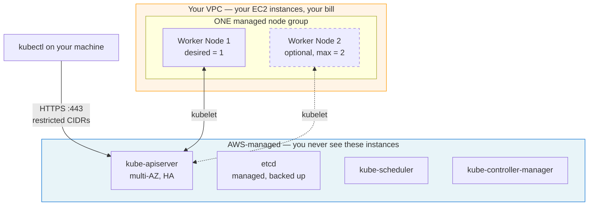
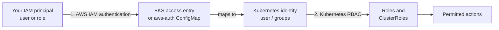

# Guide 4 — Small Amazon EKS Cluster Using eksctl

Create a **managed** Kubernetes cluster on AWS with **one** worker node, scalable to a **maximum of two**, built to cost as little as possible and to be deleted cleanly afterwards.

> [!CAUTION]
> 💰 **This guide costs money.** Unlike the kubeadm, Minikube, and Kind guides, an EKS cluster bills from the moment it exists. Read [§2 Cost warning](#2-cost-warning) before you run anything, and finish with [cleanup.md](./cleanup.md).

---

## Pages in this guide

| Page | Contents |
|---|---|
| **[prerequisites.md](./prerequisites.md)** | AWS account, IAM, tool installation, authentication, pre-flight checklist. **Start here.** |
| **README.md** (this page) | Architecture, cost, creating the cluster, verification, sample app, add-ons, IAM and access |
| **[cluster-config.yaml](./cluster-config.yaml)** | The full eksctl config file, every field commented |
| **[scaling.md](./scaling.md)** | Optional exercise: scale 1 → 2 nodes and back |
| **[cleanup.md](./cleanup.md)** | 🔴 **Do not skip.** Ordered deletion and a cost checklist |
| **[troubleshooting.md](./troubleshooting.md)** | Symptom → cause → diagnostics → resolution |
| **[manifests/](./manifests/)** | Sample application |

---

## Contents

1. [EKS architecture](#1-eks-architecture)
2. [Cost warning](#2-cost-warning)
3. [Basic low-cost architecture](#3-basic-low-cost-architecture)
4. [Create the cluster with a command](#4-create-the-cluster-with-a-command)
5. [Create the cluster with a YAML file](#5-create-the-cluster-with-a-yaml-file)
6. [Verify the cluster](#6-verify-the-cluster)
7. [Deploy the sample application](#7-deploy-the-sample-application)
8. [EKS add-ons](#8-eks-add-ons)
9. [IAM and access](#9-iam-and-access)
10. [Next steps](#10-next-steps)

---

## 1. EKS architecture

```text
AWS-Managed EKS Control Plane
             │
             ▼
Managed Node Group
├── Worker Node 1
└── Worker Node 2 — optional maximum
```



### What AWS manages vs what you manage

| Component | Who runs it | Do you see the instances? | Billed as |
|---|---|---|---|
| `kube-apiserver`, `etcd`, `kube-scheduler`, `kube-controller-manager` | **AWS** | ❌ No | A flat per-cluster, per-hour EKS charge |
| Worker nodes | **You** | ✅ Yes, in EC2 → Instances | EC2 per-second + EBS + public IPv4 |
| Node OS patching | Shared — AWS ships new AMIs, you apply them | ✅ | — |
| Your workloads | **You** | ✅ | — |

> [!IMPORTANT]
> **The EKS control plane instances are not your worker nodes and do not count towards node limits.** They run in an AWS-owned account, across multiple Availability Zones, and never appear in `kubectl get nodes` or in your EC2 console. When this guide says "one worker node, maximum two", it means the nodes **you** pay for as EC2 instances. The control plane is separate and always present.

That is the fundamental EKS trade-off: you pay a fixed hourly fee for a control plane that is highly available, patched, and backed up by AWS — versus the kubeadm guide, where the control plane is free but is one machine you maintain yourself.

---

## 2. Cost warning

> [!CAUTION]
> 💰 **Creating this cluster starts billing immediately and does not stop until you delete it.** Not when you stop using it. Not when you close your laptop. When you **delete** it.

### What bills

| Resource | Bills when | Created by this guide? |
|---|---|---|
| **EKS control plane** | Per cluster, per hour, from creation to deletion | ✅ Yes — unavoidable |
| **EC2 worker nodes** | Per second while running | ✅ Yes — 1 node (optionally 2) |
| **EBS volumes** | Per GB-month, including while the instance is stopped | ✅ Yes — 20 GB per node |
| **Public IPv4 addresses** | Per address, per hour | ✅ Yes — nodes are in public subnets |
| **Elastic Load Balancers** | Per hour plus capacity units | ⚠️ Only if you create a `LoadBalancer` Service |
| **NAT Gateway** | Per hour plus per GB processed | ❌ **No** — deliberately disabled |
| **CloudWatch Logs** | Per GB ingested and stored | ❌ No — control-plane logging is off by default |
| **Data transfer** | Per GB out of AWS, and cross-AZ | ⚠️ Small for a lab |

> [!WARNING]
> **This guide deliberately does not quote prices.** AWS pricing changes and varies by region, and a stale number in a tutorial is worse than none. Check before you create:
>
> - EKS — <https://aws.amazon.com/eks/pricing/>
> - EC2 — <https://aws.amazon.com/ec2/pricing/on-demand/>
> - EBS — <https://aws.amazon.com/ebs/pricing/>
> - Public IPv4 — <https://aws.amazon.com/vpc/pricing/>
> - ELB — <https://aws.amazon.com/elasticloadbalancing/pricing/>
> - NAT Gateway — <https://aws.amazon.com/vpc/pricing/>
>
> Or use the **AWS Pricing Calculator**: <https://calculator.aws/>

### The NAT Gateway decision

A NAT Gateway is the single largest avoidable cost in a small EKS lab. It bills hourly **plus** per GB processed, 24/7, whether or not anything uses it. For a cluster you will run for two hours, that is pure waste.

**This guide sets `nat.gateway: Disable`.**

| Architecture | Nodes in | NAT Gateway | Cost | Security | Right for |
|---|---|---|---|---|---|
| **Public subnets, no NAT** ⭐ *(this guide)* | Public subnets, with public IPs | ❌ None | Lowest | Nodes are internet-addressable; security groups are your only barrier | Temporary labs |
| Private subnets + NAT | Private subnets, no public IPs | ✅ One or more | Significantly higher | Nodes unreachable from the internet | **Production** |
| Private subnets + VPC endpoints | Private subnets | ❌ None | Middle | Good | Production where all traffic stays on AWS |

**Why public subnets work here:** nodes must reach the internet to pull container images and register with the EKS endpoint. Without a NAT Gateway, the only way out is a public IP plus an internet gateway route. That is what `privateNetworking: false` gives you.

**Why production does not do this:** an internet-addressable worker node has a much larger attack surface. One security-group mistake exposes a node directly. Production puts nodes in private subnets and routes egress through a NAT Gateway or VPC endpoints.

> [!IMPORTANT]
> Use the public-subnet design **only** for a short-lived learning cluster you will delete the same day. Do not carry this pattern into anything real.

### Endpoint access trade-offs

| Setting | Effect | Trade-off |
|---|---|---|
| `publicAccess: true` + `publicAccessCIDRs: [<your /32>]` ⭐ | API reachable from your IP only | Simple and safe. **Breaks when your ISP changes your IP** — fix with `eksctl utils update-cluster-endpoints`. |
| `publicAccess: true` + `0.0.0.0/0` | API reachable from anywhere | Authentication still applies, but there is no reason to be on the public internet. Avoid. |
| `publicAccess: false`, `privateAccess: true` | API reachable only inside the VPC | Most secure. You need a bastion, VPN, or Direct Connect to run `kubectl`. Overkill for a lab. |

### Rules that keep the bill small

1. **Delete the cluster when you finish.** Not stop — there is no "stop" for EKS. Delete. See [cleanup.md](./cleanup.md).
2. **Set a billing alert first.** [prerequisites.md §1.4](./prerequisites.md#14-set-a-billing-alert-before-you-create-anything)
3. **Use `kubectl port-forward`, not a `LoadBalancer` Service.** Port-forward costs nothing; a load balancer bills hourly.
4. **Run one node.** Scale to two only for the exercise in [scaling.md](./scaling.md), then scale back.
5. **Leave CloudWatch control-plane logging off** unless you are actively debugging.
6. **Set a calendar reminder** for the same day to delete it.

---

## 3. Basic low-cost architecture

What the configuration in this guide builds:

| Component | Setting | Why |
|---|---|---|
| EKS clusters | **1** | — |
| Managed node groups | **1** | One is all a lab needs |
| Desired capacity | **1** | Start minimal |
| Minimum capacity | **1** | Never scale to zero — EKS needs at least one node for CoreDNS |
| **Maximum capacity** | **2** | 🔴 Hard ceiling. Never raise it. |
| Instance type | One moderately sized learning type (e.g. `t3.medium`) | 2 vCPU / 4 GB fits the system DaemonSets plus a small app |
| Root volume | 20 GB gp3 per node | Enough for images; gp3 is cheaper than gp2 |
| Endpoint | Public, restricted CIDRs | Simple `kubectl` access without exposing to the world |
| Subnets | Public | Avoids a NAT Gateway |
| NAT Gateway | **None** | Biggest avoidable cost |
| Bastion host | **None** | Another instance to pay for |
| Additional node groups | **None** | — |
| CloudWatch control-plane logs | **Off** | Billable, rarely needed |
| OIDC provider | **Enabled** | Free; required for IRSA and the EBS CSI add-on |

> [!NOTE]
> **Production looks different**, and deliberately so: nodes in private subnets, NAT Gateway or VPC endpoints for egress, a private or tightly restricted API endpoint, multiple node groups for workload isolation, control-plane logging on, PodDisruptionBudgets, and a node count that tolerates a node failure. Every one of those costs money — which is exactly why they are absent here.

---

## 4. Create the cluster with a command

> [!IMPORTANT]
> Complete **[prerequisites.md](./prerequisites.md)** first — especially the pre-flight checklist. A failed cluster creation still leaves billable resources behind.

### 4.1 Set your variables

```bash
# Local terminal
export CLUSTER_NAME=<CLUSTER_NAME>                 # e.g. eks-lab
export AWS_REGION=<AWS_REGION>                     # e.g. us-east-1
export KUBERNETES_VERSION=<KUBERNETES_VERSION>     # e.g. 1.36
export NODE_GROUP_NAME=<NODE_GROUP_NAME>           # e.g. ng-lab
export INSTANCE_TYPE=<INSTANCE_TYPE>               # e.g. t3.medium

echo "$CLUSTER_NAME / $AWS_REGION / $KUBERNETES_VERSION / $NODE_GROUP_NAME / $INSTANCE_TYPE"
aws sts get-caller-identity          # last chance to confirm the account
```

### 4.2 The command

```bash
# Local terminal
eksctl create cluster \
  --name "${CLUSTER_NAME}" \
  --region "${AWS_REGION}" \
  --version "${KUBERNETES_VERSION}" \
  --nodegroup-name "${NODE_GROUP_NAME}" \
  --node-type "${INSTANCE_TYPE}" \
  --nodes 1 \
  --nodes-min 1 \
  --nodes-max 2 \
  --node-volume-size 20 \
  --node-volume-type gp3 \
  --managed \
  --node-labels "role=worker,environment=learning" \
  --tags "Environment=learning,Purpose=kubernetes-training,Owner=<YOUR_NAME_OR_TEAM>" \
  --with-oidc \
  --vpc-nat-mode Disable \
  --node-private-networking=false \
  --alb-ingress-access=false \
  --asg-access=false
```

### 4.3 Every argument explained

| Argument | Meaning |
|---|---|
| `--name` | Cluster name. Also prefixes the CloudFormation stacks (`eksctl-<name>-cluster`). |
| `--region` | Every resource is created here. |
| `--version` | Kubernetes **minor** version, e.g. `1.36`. Must be an EKS-supported version. |
| `--nodegroup-name` | Name of the single managed node group. |
| `--node-type` | EC2 instance type for workers. |
| `--nodes 1` | **Desired capacity — start with one node.** |
| `--nodes-min 1` | Never fewer than one. EKS needs a node for CoreDNS. |
| `--nodes-max 2` | 🔴 **Hard ceiling. Never raise it in this guide.** |
| `--node-volume-size 20` | GB of EBS root volume per node. |
| `--node-volume-type gp3` | Cheaper and faster than gp2. |
| `--managed` | Create a **managed** node group — AWS handles AMI updates and graceful draining. Without this you get a self-managed group and much more work. |
| `--node-labels` | Kubernetes labels on each node, usable as `nodeSelector` targets. |
| `--tags` | AWS resource tags. Essential for cost allocation and for finding leftovers later. |
| `--with-oidc` | Create the IAM OIDC provider, enabling IRSA. Free; enable it. |
| `--vpc-nat-mode Disable` | 💰 **No NAT Gateway.** The single biggest cost saving. |
| `--node-private-networking=false` | Nodes in public subnets with public IPs — required when there is no NAT Gateway. |
| `--alb-ingress-access=false` | Do not grant the node role ALB permissions. Not needed and reduces node privilege. |
| `--asg-access=false` | Do not grant Auto Scaling permissions. Only needed for Cluster Autoscaler. |

### 4.4 What happens, and how long

Creation takes **15–20 minutes**. `eksctl` builds two CloudFormation stacks:

1. `eksctl-<CLUSTER_NAME>-cluster` — VPC, subnets, route tables, internet gateway, security groups, IAM roles, and the EKS control plane (~10–12 min, mostly waiting on the control plane)
2. `eksctl-<CLUSTER_NAME>-nodegroup-<NODE_GROUP_NAME>` — the node IAM role, Auto Scaling group, and the managed node group (~4–6 min)

**Expected output** (abridged):

```text
2026-08-05 10:00:00 [ℹ]  eksctl version 0.229.0
2026-08-05 10:00:00 [ℹ]  using region us-east-1
2026-08-05 10:00:01 [ℹ]  setting availability zones to [us-east-1a us-east-1b]
2026-08-05 10:00:02 [ℹ]  building cluster stack "eksctl-eks-lab-cluster"
2026-08-05 10:00:03 [ℹ]  deploying stack "eksctl-eks-lab-cluster"
...
2026-08-05 10:12:30 [ℹ]  building managed nodegroup stack "eksctl-eks-lab-nodegroup-ng-lab"
2026-08-05 10:16:45 [ℹ]  waiting for the control plane to become ready
2026-08-05 10:17:00 [✔]  saved kubeconfig as "/home/you/.kube/config"
2026-08-05 10:17:01 [ℹ]  no tasks
2026-08-05 10:17:01 [✔]  all EKS cluster resources for "eks-lab" have been created
2026-08-05 10:17:05 [ℹ]  nodegroup "ng-lab" has 1 node(s)
2026-08-05 10:17:05 [ℹ]  node "ip-192-168-12-34.ec2.internal" is ready
2026-08-05 10:17:06 [✔]  EKS cluster "eks-lab" in "us-east-1" region is ready
```

> [!TIP]
> **Do not interrupt it.** `Ctrl+C` leaves half-built CloudFormation stacks that still bill. If you must stop, let it finish and then delete properly with [cleanup.md](./cleanup.md).
>
> Watch progress in another terminal:
> ```bash
> watch -n 30 "aws cloudformation list-stacks --region $AWS_REGION \
>   --query 'StackSummaries[?starts_with(StackName, \`eksctl-\`)].{Name:StackName,Status:StackStatus}' --output table"
> ```

---

## 5. Create the cluster with a YAML file

A config file is reproducible, reviewable, and supports options the CLI flags do not — add-ons, access entries, and per-add-on IAM policies.

### 5.1 Prepare the file

[`cluster-config.yaml`](./cluster-config.yaml) in this directory is complete and fully commented. Copy it and replace the placeholders:

```bash
# Local terminal
cp cluster-config.yaml my-cluster.yaml
```

Replace every `<PLACEHOLDER>`:

| Placeholder | Example | Notes |
|---|---|---|
| `<CLUSTER_NAME>` | `eks-lab` | Lowercase letters, digits, hyphens |
| `<AWS_REGION>` | `us-east-1` | |
| `<KUBERNETES_VERSION>` | `"1.36"` | **Quoted**, minor version only |
| `<NODE_GROUP_NAME>` | `ng-lab` | |
| `<INSTANCE_TYPE>` | `t3.medium` | |
| `<INSTANCE_TYPE_ALTERNATE>` | `t3a.medium` | Or delete the line |
| `<YOUR_PUBLIC_IP_CIDR>` | `203.0.113.45/32` | From `curl -s https://checkip.amazonaws.com` |
| `<YOUR_NAME_OR_TEAM>` | `platform-team` | |
| `<YYYY-MM-DD>` | `2026-08-05` | A reminder for you — AWS does not act on it |

Check nothing was missed:

```bash
# Local terminal
grep -n '<' my-cluster.yaml && echo "❌ placeholders remain" || echo "✅ no placeholders left"
```

### 5.2 What the config contains

The file is annotated in full. The key sections:

| Section | Purpose |
|---|---|
| `metadata` | Name, region, Kubernetes version, tags |
| `iam.withOIDC: true` | OIDC provider for IRSA |
| `accessConfig` | `API_AND_CONFIG_MAP` mode, cluster-creator admin permissions |
| `vpc.nat.gateway: Disable` | 💰 No NAT Gateway |
| `vpc.clusterEndpoints` + `publicAccessCIDRs` | Public endpoint restricted to your IP |
| `managedNodeGroups` | **One** group: desired 1, min 1, **max 2**, 20 GB gp3, public subnets, SSM enabled, SSH disabled |
| `addons` | VPC CNI, kube-proxy, CoreDNS, EBS CSI driver |
| `cloudWatch` | Commented out — 💰 logging is billable |

> [!IMPORTANT]
> There is **one** entry under `managedNodeGroups` and **no** second node group. `maxSize` is `2`. Do not change either.

### 5.3 Create

```bash
# Local terminal
eksctl create cluster -f my-cluster.yaml
```

Same 15–20 minutes, same output as §4.4.

### 5.4 Dry run first

See exactly what would be created, without creating it:

```bash
# Local terminal
eksctl create cluster -f my-cluster.yaml --dry-run
```

This prints the fully-resolved config — every default eksctl filled in. Worth reading once.

---

## 6. Verify the cluster

### 6.1 Cluster and kubeconfig

```bash
# Local terminal
eksctl get cluster --name "${CLUSTER_NAME}" --region "${AWS_REGION}" -o yaml

aws eks describe-cluster --name "${CLUSTER_NAME}" --region "${AWS_REGION}" \
  --query 'cluster.{Name:name,Status:status,Version:version,Endpoint:endpoint,PlatformVersion:platformVersion}' \
  --output table
```

**Expected output:**

```text
------------------------------------------------------------
|                      DescribeCluster                     |
+------------------+---------------------------------------+
|  Endpoint        |  https://XXXX.gr7.us-east-1.eks.amazonaws.com |
|  Name            |  eks-lab                              |
|  PlatformVersion |  eks.x                                |
|  Status          |  ACTIVE                               |
|  Version         |  1.36                                 |
+------------------+---------------------------------------+
```

`Status` must be `ACTIVE`.

### 6.2 kubeconfig and context

`eksctl` writes the kubeconfig for you. To (re)write it manually:

```bash
# Local terminal
aws eks update-kubeconfig --name "${CLUSTER_NAME}" --region "${AWS_REGION}"

kubectl config current-context
kubectl config get-contexts
```

**Expected output:**

```text
Updated context arn:aws:eks:us-east-1:123456789012:cluster/eks-lab in /home/you/.kube/config
arn:aws:eks:us-east-1:123456789012:cluster/eks-lab
```

> [!IMPORTANT]
> The EKS context name is the full cluster ARN. If you also have Kind, Minikube, or Docker Desktop contexts, **check this before every destructive command.**

### 6.3 Node group and node count

```bash
# Local terminal
eksctl get nodegroup --cluster "${CLUSTER_NAME}" --region "${AWS_REGION}"

aws eks describe-nodegroup \
  --cluster-name "${CLUSTER_NAME}" \
  --nodegroup-name "${NODE_GROUP_NAME}" \
  --region "${AWS_REGION}" \
  --query 'nodegroup.{Name:nodegroupName,Status:status,Desired:scalingConfig.desiredSize,Min:scalingConfig.minSize,Max:scalingConfig.maxSize,Types:instanceTypes,AMI:amiType}' \
  --output table
```

**Expected output:**

```text
+---------------------------------------------+
|              DescribeNodegroup              |
+-----------+---------------------------------+
|  Desired  |  1                              |
|  Max      |  2                              |
|  Min      |  1                              |
|  Name     |  ng-lab                         |
|  Status   |  ACTIVE                         |
|  AMI      |  AL2023_x86_64_STANDARD         |
+-----------+---------------------------------+
```

✅ `Desired: 1`, `Min: 1`, `Max: 2`.

### 6.4 Node readiness

```bash
# Local terminal
kubectl get nodes -o wide
```

**Expected output — the initial result should show exactly one worker node:**

```text
NAME                            STATUS   ROLES    AGE   VERSION               INTERNAL-IP      EXTERNAL-IP     OS-IMAGE                        CONTAINER-RUNTIME
ip-192-168-12-34.ec2.internal   Ready    <none>   3m    v1.36.x-eks-xxxxxxx   192.168.12.34    54.xx.xx.xx     Amazon Linux 2023               containerd://2.x.x
```

Points worth noticing:

- **One node.** That is correct — desired capacity is 1.
- **`ROLES: <none>`** — normal on EKS. The control plane is AWS-managed and never appears here.
- **`EXTERNAL-IP` is populated** — the node is in a public subnet (the no-NAT-Gateway design). 💰 That public IPv4 address is billable.
- **No control-plane taint to remove** — unlike kubeadm, EKS worker nodes are plain workers, so your Pods schedule immediately.

```bash
# Local terminal
kubectl describe node "$(kubectl get nodes -o jsonpath='{.items[0].metadata.name}')" | grep -i -A3 taints
```

**Expected output:** `Taints: <none>`

### 6.5 System Pods

```bash
# Local terminal
kubectl get pods -n kube-system -o wide
```

**Expected output:**

```text
NAME                       READY   STATUS    RESTARTS   AGE   NODE
aws-node-xxxxx             2/2     Running   0          3m    ip-192-168-12-34...
coredns-xxxxxxxxx-xxxxx    1/1     Running   0          5m    ip-192-168-12-34...
coredns-xxxxxxxxx-yyyyy    1/1     Running   0          5m    ip-192-168-12-34...
kube-proxy-xxxxx           1/1     Running   0          3m    ip-192-168-12-34...
```

| Pod | What it is |
|---|---|
| `aws-node` | The **Amazon VPC CNI** DaemonSet — assigns real VPC IPs to Pods |
| `coredns` | Cluster DNS (two replicas by default, both on your one node) |
| `kube-proxy` | Service networking on the node |

If you enabled the EBS CSI add-on you will also see `ebs-csi-controller-*` and `ebs-csi-node-*`.

### 6.6 Add-on versions

```bash
# Local terminal
aws eks list-addons --cluster-name "${CLUSTER_NAME}" --region "${AWS_REGION}" --output table

for a in vpc-cni coredns kube-proxy aws-ebs-csi-driver; do
  aws eks describe-addon --cluster-name "${CLUSTER_NAME}" --addon-name "$a" --region "${AWS_REGION}" \
    --query 'addon.{Addon:addonName,Version:addonVersion,Status:status}' --output text 2>/dev/null
done
```

### 6.7 CloudFormation stacks

```bash
# Local terminal
aws cloudformation list-stacks --region "${AWS_REGION}" \
  --stack-status-filter CREATE_COMPLETE UPDATE_COMPLETE \
  --query "StackSummaries[?starts_with(StackName, 'eksctl-${CLUSTER_NAME}')].{Name:StackName,Status:StackStatus}" \
  --output table
```

**Expected output:** exactly two stacks.

```text
+------------------------------------------------+-------------------+
|  eksctl-eks-lab-cluster                        |  CREATE_COMPLETE  |
|  eksctl-eks-lab-nodegroup-ng-lab               |  CREATE_COMPLETE  |
+------------------------------------------------+-------------------+
```

These are what `eksctl delete cluster` removes later. If one is `ROLLBACK_COMPLETE` or `CREATE_FAILED`, see [troubleshooting.md](./troubleshooting.md).

### 6.8 Full verification checklist

```bash
# Local terminal
echo "=== Cluster ==="        && aws eks describe-cluster --name "${CLUSTER_NAME}" --region "${AWS_REGION}" --query 'cluster.status' --output text
echo "=== Context ==="        && kubectl config current-context
echo "=== Nodes ==="          && kubectl get nodes
echo "=== Node count ==="     && kubectl get nodes --no-headers | wc -l
echo "=== System pods ==="    && kubectl get pods -n kube-system
echo "=== Addons ==="         && aws eks list-addons --cluster-name "${CLUSTER_NAME}" --region "${AWS_REGION}" --query 'addons' --output text
echo "=== API health ==="     && kubectl get --raw='/readyz?verbose' | tail -3
echo "=== DNS test ==="       && kubectl run dnstest --image=busybox:1.37 --rm -it --restart=Never -- nslookup kubernetes.default 2>/dev/null | tail -4
```

✅ Node count must be **1**.

---

## 7. Deploy the sample application

Manifests are in [`manifests/`](./manifests/).

### 7.1 Deploy

```bash
# Local terminal
cd kubernetes-cluster-setup/eksctl
kubectl apply -f manifests/00-namespace.yaml
kubectl apply -f manifests/10-deployment.yaml
kubectl apply -f manifests/20-service-clusterip.yaml

kubectl -n demo rollout status deployment/web --timeout=180s
kubectl -n demo get all -o wide
```

**Expected output:**

```text
namespace/demo created
deployment.apps/web created
service/web created

NAME                      READY   STATUS    RESTARTS   AGE   IP               NODE
pod/web-6c9d8f7b4-abcde   1/1     Running   0          30s   192.168.15.201   ip-192-168-12-34...
pod/web-6c9d8f7b4-fghij   1/1     Running   0          30s   192.168.20.55    ip-192-168-12-34...

NAME          TYPE        CLUSTER-IP      PORT(S)   AGE
service/web   ClusterIP   10.100.171.22   80/TCP    30s

NAME                  READY   UP-TO-DATE   AVAILABLE   AGE
deployment.apps/web   2/2     2            2           30s
```

> [!NOTE]
> **Look at the Pod IPs: `192.168.x.x` — real VPC addresses.** That is the Amazon VPC CNI at work. Unlike Calico or kindnet, EKS Pods get genuine VPC IPs, so they are routable inside the VPC and can be targeted by security groups. The trade-off is that the number of Pods a node can run is limited by how many ENIs and IPs its instance type supports.

**Both replicas on one node is expected** — `replicas: 2` means two Pods, not two machines.

### 7.2 Access it — `kubectl port-forward` (the default, costs nothing)

```bash
# Local terminal — leave running
kubectl -n demo port-forward svc/web 8080:80
```

```bash
# Local terminal (second window)
curl -s http://localhost:8080 | head -5
```

**Expected output:** the nginx welcome page HTML.

> [!TIP]
> 💰 **This is the cost-conscious way to reach a workload on EKS.** It tunnels through the API server and creates **no** billable AWS infrastructure — no load balancer, no extra public IP, no idle hourly charge. Use it by default.

### 7.3 Optional exercise — a LoadBalancer Service

> [!CAUTION]
> 💰 **Applying this makes AWS provision a real Network Load Balancer.** An NLB bills hourly plus capacity units for as long as it exists, and its public IPv4 addresses bill separately — whether or not anyone uses it. **Delete it as soon as you have seen it work.**

```bash
# Local terminal
export MY_IP="$(curl -s https://checkip.amazonaws.com)/32"
sed "s|<YOUR_PUBLIC_IP_CIDR>|${MY_IP}|" manifests/30-service-loadbalancer.yaml | kubectl apply -f -

kubectl -n demo get svc web-lb -w      # Ctrl+C when EXTERNAL-IP appears
```

Provisioning takes 2–4 minutes.

**Expected output:**

```text
NAME     TYPE           CLUSTER-IP      EXTERNAL-IP                          PORT(S)        AGE
web-lb   LoadBalancer   10.100.55.190   k8s-demo-weblb-xxxx.elb.amazonaws.com   80:31234/TCP   3m
```

Test it:

```bash
# Local terminal
LB=$(kubectl -n demo get svc web-lb -o jsonpath='{.status.loadBalancer.ingress[0].hostname}')
echo "http://${LB}"
curl -s "http://${LB}" | head -5
```

DNS can take a couple of minutes to propagate; retry if it fails at first.

### 7.4 🔴 Delete the LoadBalancer immediately

```bash
# Local terminal  💰 do this as soon as you have tested
kubectl -n demo delete svc web-lb
```

✅ **Verify it is really gone** — this matters, because a deleted Service does not always mean a deleted load balancer:

```bash
# Local terminal
sleep 30
aws elbv2 describe-load-balancers --region "${AWS_REGION}" \
  --query 'LoadBalancers[].{Name:LoadBalancerName,DNS:DNSName,Created:CreatedTime}' --output table

aws elb describe-load-balancers --region "${AWS_REGION}" \
  --query 'LoadBalancerDescriptions[].LoadBalancerName' --output table
```

**Expected output:** empty (or only load balancers you own for other reasons).

> [!CAUTION]
> 🔴 **Deleting the EKS cluster does not reliably delete load balancers created by Services.** Kubernetes created them, so Kubernetes must delete them — and if the cluster is gone, nothing is left to do it. Always delete `LoadBalancer` Services **before** deleting the cluster. This is the number-one source of surprise EKS bills. See [cleanup.md](./cleanup.md).

---

## 8. EKS add-ons

**Managed add-ons** are AWS-packaged cluster components. AWS tracks compatible versions and can update them for you, instead of you applying raw manifests.

```bash
# Local terminal
aws eks list-addons --cluster-name "${CLUSTER_NAME}" --region "${AWS_REGION}" --output table
aws eks describe-addon-versions --kubernetes-version "${KUBERNETES_VERSION}" \
  --query 'addons[].addonName' --output table
```

### 8.1 The core four

| Add-on | What it does | In this lab |
|---|---|---|
| **Amazon VPC CNI** (`vpc-cni`) | Gives every Pod a real VPC IP via ENIs on the node. Why EKS Pods integrate natively with security groups and VPC routing — and why instance type caps Pods-per-node. | ✅ Required |
| **CoreDNS** (`coredns`) | Cluster DNS. Two replicas by default; on a single node both land there. | ✅ Required |
| **kube-proxy** (`kube-proxy`) | Implements Service networking on each node. | ✅ Required |
| **EBS CSI driver** (`aws-ebs-csi-driver`) | Provisions EBS volumes for PersistentVolumeClaims. **Not installed by default** — without it, PVCs stay `Pending` forever. Needs IRSA. 💰 Each provisioned volume is a billable EBS volume. | ⚠️ Optional |

Install the EBS CSI driver if you skipped it:

```bash
# Local terminal
eksctl create addon --name aws-ebs-csi-driver \
  --cluster "${CLUSTER_NAME}" --region "${AWS_REGION}" \
  --service-account-role-arn "$(aws iam list-roles \
      --query "Roles[?contains(RoleName, 'ebs-csi')].Arn" --output text | head -1)" \
  --force
```

Or let eksctl create the IRSA role for you — that is what `wellKnownPolicies.ebsCSIController: true` in [cluster-config.yaml](./cluster-config.yaml) does.

### 8.2 Worth knowing about — not installed here

Keep the base cluster light. Each of these consumes resources on your single node, and some create billable AWS infrastructure.

| Component | What it does | Why not here |
|---|---|---|
| **Metrics Server** | Powers `kubectl top` and HorizontalPodAutoscaler | Small; add it if you want `kubectl top`: `kubectl apply -f https://github.com/kubernetes-sigs/metrics-server/releases/latest/download/components.yaml` |
| **AWS Load Balancer Controller** | Turns Ingress resources into ALBs, and Services into NLBs, with rich annotations | 💰 Every Ingress becomes a billable ALB. Essential in production, unnecessary for a lab. |
| **Cluster Autoscaler** | Scales the node group up and down based on pending Pods | 💰 Could scale you to `maxSize`. With `maxSize: 2` the risk is capped, but it also needs `--asg-access` node permissions. |
| **Karpenter** | Modern, faster node provisioner that picks instance types itself | 💰 Powerful and genuinely better than Cluster Autoscaler in production — and very capable of launching more nodes than a lab budget wants. |
| **EKS Pod Identity** | Newer, simpler alternative to IRSA for giving Pods IAM roles | Nothing in this lab needs AWS API access from a Pod |
| **EFS CSI driver** | ReadWriteMany volumes backed by EFS | 💰 EFS is billable |
| **AWS for Fluent Bit / Container Insights** | Ships logs and metrics to CloudWatch | 💰 CloudWatch ingestion and storage are billable |

**Fargate** (optional explanation): EKS Fargate runs Pods with no EC2 nodes at all — AWS provisions the compute per Pod and bills per vCPU-second and GB-second. It removes node management entirely, but Fargate Pods cannot use DaemonSets, host networking, or privileged containers, and per-Pod pricing is usually higher than a well-used EC2 node. This guide uses a managed node group so you can see and understand the worker nodes. No Fargate profile is created.

---

## 9. IAM and access

EKS access is **two systems in series**. You must pass both.



1. **AWS IAM authentication** — proves *who you are*. `kubectl` calls `aws eks get-token`, which signs a request with your AWS credentials.
2. **Kubernetes RBAC** — decides *what you may do*. Your IAM identity is mapped to a Kubernetes user and groups, and RBAC rules apply from there.

Being an AWS account administrator gives you **no** Kubernetes permissions by itself. The mapping in step 1 has to exist.

### 9.1 EKS access entries — the current approach

The modern mechanism. Managed through the AWS API instead of by hand-editing a ConfigMap.

```bash
# Local terminal
aws eks list-access-entries --cluster-name "${CLUSTER_NAME}" --region "${AWS_REGION}" --output table

aws eks describe-access-entry \
  --cluster-name "${CLUSTER_NAME}" --region "${AWS_REGION}" \
  --principal-arn "$(aws sts get-caller-identity --query Arn --output text)" \
  --output table 2>/dev/null || echo "No explicit access entry — you are the cluster creator"
```

**Authentication modes:**

| Mode | Behaviour |
|---|---|
| `CONFIG_MAP` | Legacy — `aws-auth` ConfigMap only |
| `API_AND_CONFIG_MAP` ⭐ | Both. What this guide uses; safest during migration |
| `API` | Access entries only |

**Cluster access policies** — AWS-managed permission sets you attach to an access entry:

| Policy | Grants |
|---|---|
| `AmazonEKSClusterAdminPolicy` | Full cluster admin |
| `AmazonEKSAdminPolicy` | Admin, but not cluster-scoped resource management |
| `AmazonEKSEditPolicy` | Read/write on most namespaced resources |
| `AmazonEKSViewPolicy` | Read-only |

**Grant a colleague read-only access:**

```bash
# Local terminal
aws eks create-access-entry \
  --cluster-name "${CLUSTER_NAME}" --region "${AWS_REGION}" \
  --principal-arn "arn:aws:iam::<ACCOUNT_ID>:role/<ROLE_NAME>" \
  --type STANDARD

aws eks associate-access-policy \
  --cluster-name "${CLUSTER_NAME}" --region "${AWS_REGION}" \
  --principal-arn "arn:aws:iam::<ACCOUNT_ID>:role/<ROLE_NAME>" \
  --policy-arn "arn:aws:eks::aws:cluster-access-policy/AmazonEKSViewPolicy" \
  --access-scope type=cluster
```

Or with eksctl:

```bash
# Local terminal
eksctl create accessentry \
  --cluster "${CLUSTER_NAME}" --region "${AWS_REGION}" \
  --principal-ARN "arn:aws:iam::<ACCOUNT_ID>:role/<ROLE_NAME>" \
  --access-policy-arn "arn:aws:eks::aws:cluster-access-policy/AmazonEKSViewPolicy" \
  --access-scope-type cluster
```

### 9.2 Cluster creator access

`bootstrapClusterCreatorAdminPermissions: true` (the default, and what this guide sets) gives the IAM principal that **created** the cluster full cluster-admin.

> [!IMPORTANT]
> **This binds to the exact principal ARN that created the cluster.** If you created it while assuming a role and later use a different role, you may lose access even as an account administrator. That is by design, and it is why the first `kubectl` command failing with "you must be logged in to the server" so often traces back to a different profile.
>
> Fix by creating an access entry for your current principal — from a principal that still has access.

Check your Kubernetes-side permissions:

```bash
# Local terminal
kubectl auth whoami                       # Kubernetes 1.28+
kubectl auth can-i --list | head -20
kubectl auth can-i create deployments -n demo
```

### 9.3 The legacy `aws-auth` ConfigMap

Still present in `API_AND_CONFIG_MAP` mode:

```bash
# Local terminal
kubectl -n kube-system get configmap aws-auth -o yaml
```

It maps IAM ARNs to Kubernetes users and groups. Historically the only mechanism, and historically dangerous — a bad edit could lock everyone out of the cluster irreversibly. **Prefer access entries.**

### 9.4 The node group IAM role

Each worker node assumes an IAM role, created by eksctl with these managed policies:

| Policy | Why |
|---|---|
| `AmazonEKSWorkerNodePolicy` | Lets the kubelet describe the cluster and register the node |
| `AmazonEC2ContainerRegistryReadOnly` | Pull images from ECR |
| `AmazonEKS_CNI_Policy` | Lets the VPC CNI manage ENIs and IPs |
| `AmazonSSMManagedInstanceCore` | SSM Session Manager access (because `enableSsm: true`) |

```bash
# Local terminal
NODE_ROLE=$(aws eks describe-nodegroup \
  --cluster-name "${CLUSTER_NAME}" --nodegroup-name "${NODE_GROUP_NAME}" \
  --region "${AWS_REGION}" --query 'nodegroup.nodeRole' --output text)
echo "$NODE_ROLE"

aws iam list-attached-role-policies --role-name "$(basename "$NODE_ROLE")" --output table
```

### 9.5 Why applications must not inherit the node role

> [!CAUTION]
> 🔴 **Every Pod on a node can reach the instance metadata service and assume the node's IAM role** — unless you block it. If you attach `AmazonS3FullAccess` to the node role so "the app can read a bucket", then *every* Pod on that node can read and delete *every* bucket in your account. Including a compromised sidecar. Including someone else's workload.

Grant permissions to the workload, not the node:

| Mechanism | How it works | Use when |
|---|---|---|
| **IRSA** (IAM Roles for Service Accounts) | The OIDC provider lets a ServiceAccount exchange a projected token for IAM credentials. Requires `withOIDC: true`. | The established, widely supported approach |
| **EKS Pod Identity** ⭐ | An agent DaemonSet delivers credentials; you associate a role with a ServiceAccount through the EKS API. No OIDC trust policy to write, works across clusters. | The newer, simpler option |

**IRSA example** (creates the IAM role, trust policy, and annotated ServiceAccount in one command):

```bash
# Local terminal
eksctl create iamserviceaccount \
  --cluster "${CLUSTER_NAME}" --region "${AWS_REGION}" \
  --namespace demo \
  --name s3-reader \
  --attach-policy-arn arn:aws:iam::aws:policy/AmazonS3ReadOnlyAccess \
  --approve
```

Then reference it in a Pod spec:

```yaml
spec:
  serviceAccountName: s3-reader
```

That Pod — and only that Pod — gets S3 read access. Its neighbours on the same node do not.

**Extra hardening:** require IMDSv2 with a hop limit of 1 on nodes, so containers cannot reach the metadata service at all. Managed node groups with AL2023 default to IMDSv2.

---

## 10. Next steps

| What | Where |
|---|---|
| Scale 1 → 2 nodes and back | **[scaling.md](./scaling.md)** |
| Something is broken | **[troubleshooting.md](./troubleshooting.md)** |
| 🔴 **Delete everything and stop the bill** | **[cleanup.md](./cleanup.md)** |

> [!CAUTION]
> 💰 **Before you close this page: are you finished?** If so, go to [cleanup.md](./cleanup.md) now. An EKS cluster left running overnight, over a weekend, or forgotten for a month is the most common way people are surprised by an AWS bill.

---

## Official documentation

- Amazon EKS User Guide — <https://docs.aws.amazon.com/eks/latest/userguide/what-is-eks.html>
- eksctl — <https://eksctl.io/>
- eksctl config schema — <https://eksctl.io/usage/schema/>
- EKS pricing — <https://aws.amazon.com/eks/pricing/>
- Managed node groups — <https://docs.aws.amazon.com/eks/latest/userguide/managed-node-groups.html>
- EKS add-ons — <https://docs.aws.amazon.com/eks/latest/userguide/eks-add-ons.html>
- Amazon VPC CNI — <https://docs.aws.amazon.com/eks/latest/userguide/managing-vpc-cni.html>
- EKS access entries — <https://docs.aws.amazon.com/eks/latest/userguide/access-entries.html>
- IAM Roles for Service Accounts — <https://docs.aws.amazon.com/eks/latest/userguide/iam-roles-for-service-accounts.html>
- EKS Pod Identity — <https://docs.aws.amazon.com/eks/latest/userguide/pod-identities.html>
- Cluster endpoint access — <https://docs.aws.amazon.com/eks/latest/userguide/cluster-endpoint.html>
- Kubernetes versions on EKS — <https://docs.aws.amazon.com/eks/latest/userguide/kubernetes-versions-standard.html>
