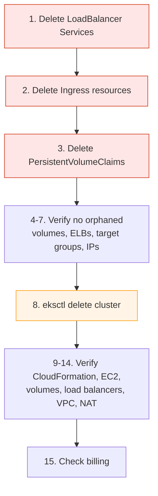

# EKS — Deleting the Cluster and Stopping the Bill

> [!CAUTION]
> 💰 **There is no "stop" for an EKS cluster.** The control plane bills every hour it exists, whether or not you use it. The only way to stop paying is to **delete** it.

Follow the steps **in order**. The order matters: several resources are created *by Kubernetes* rather than by eksctl, and once the cluster is gone there is nothing left to clean them up. They then bill indefinitely.

```bash
# Local terminal — set these once
export CLUSTER_NAME=<CLUSTER_NAME>
export AWS_REGION=<AWS_REGION>
export NODE_GROUP_NAME=<NODE_GROUP_NAME>

aws sts get-caller-identity --query Arn --output text
kubectl config current-context
```

✅ Confirm the context is the EKS cluster ARN — not a Kind, Minikube, or another EKS cluster.

---

## The strict order



> [!IMPORTANT]
> **Steps 1–3 must happen BEFORE step 8.** Load balancers, target groups, and EBS volumes created by Kubernetes objects are deleted by the *controllers inside the cluster*. Delete the cluster first and those controllers die with it, leaving orphaned billable AWS resources that `eksctl delete cluster` will not touch. This is the single most common cause of a surprise EKS bill.

---

## 1. Delete LoadBalancer Services

Each one corresponds to a real, billable Elastic Load Balancer.

```bash
# Local terminal
kubectl get svc -A --field-selector spec.type=LoadBalancer
```

**Expected output if you followed the guide:** `No resources found` — the default access method was `kubectl port-forward`.

If any exist:

```bash
# Local terminal  🔴 DESTRUCTIVE
kubectl delete svc web-lb -n demo

# or delete every LoadBalancer Service in the cluster
kubectl get svc -A --field-selector spec.type=LoadBalancer \
  -o custom-columns='NS:.metadata.namespace,NAME:.metadata.name' --no-headers \
  | while read -r ns name; do kubectl delete svc "$name" -n "$ns"; done
```

**Wait for AWS to actually remove the load balancer** — deletion is asynchronous and takes a minute or two:

```bash
# Local terminal
sleep 60
aws elbv2 describe-load-balancers --region "${AWS_REGION}" \
  --query 'LoadBalancers[].{Name:LoadBalancerName,Type:Type,DNS:DNSName}' --output table
```

Do not continue until this shows no load balancers belonging to this cluster.

---

## 2. Delete Ingress resources

An Ingress backed by the AWS Load Balancer Controller creates an **ALB** — also billable.

```bash
# Local terminal
kubectl get ingress -A
```

If any exist:

```bash
# Local terminal  🔴 DESTRUCTIVE
kubectl delete ingress --all -A
sleep 60
```

Then re-check load balancers as in step 1.

---

## 3. Delete PersistentVolumeClaims

A PVC backed by the EBS CSI driver creates a real EBS volume. Whether deleting the PVC deletes the volume depends on the StorageClass's `reclaimPolicy`.

```bash
# Local terminal
kubectl get pvc -A
kubectl get pv
kubectl get storageclass -o custom-columns='NAME:.metadata.name,RECLAIM:.reclaimPolicy'
```

**Expected output if you followed the guide:** no PVCs — the sample app uses none.

If any exist:

```bash
# Local terminal  🔴 DESTRUCTIVE — deletes the data on those volumes
kubectl delete pvc --all -A
sleep 30
kubectl get pv        # should be empty
```

> [!WARNING]
> If a StorageClass has `reclaimPolicy: Retain`, deleting the PVC leaves the EBS volume behind **on purpose**. Step 4 catches those.

---

## 4. Check EBS volumes

```bash
# Local terminal
aws ec2 describe-volumes --region "${AWS_REGION}" \
  --filters Name=status,Values=available \
  --query 'Volumes[].{ID:VolumeId,Size:Size,Type:VolumeType,Created:CreateTime,Tags:Tags[?Key==`kubernetes.io/cluster/'"${CLUSTER_NAME}"'`].Value|[0]}' \
  --output table
```

Any volume in `available` state is unattached and **billing for nothing**.

```bash
# Local terminal  🔴 DESTRUCTIVE
aws ec2 delete-volume --volume-id <VOLUME_ID> --region "${AWS_REGION}"
```

**Console:** EC2 → Elastic Block Store → **Volumes**, filter `State = available`.

> [!NOTE]
> Node root volumes are attached to running instances at this point, so they will not appear here yet. They are deleted with the instances in step 8. Re-check in step 11.

---

## 5. Check Elastic Load Balancers

```bash
# Local terminal
echo "=== ALB / NLB (v2) ==="
aws elbv2 describe-load-balancers --region "${AWS_REGION}" \
  --query 'LoadBalancers[].{Name:LoadBalancerName,Type:Type,VPC:VpcId,Created:CreatedTime}' --output table

echo "=== Classic ELB ==="
aws elb describe-load-balancers --region "${AWS_REGION}" \
  --query 'LoadBalancerDescriptions[].{Name:LoadBalancerName,VPC:VPCId}' --output table
```

**Expected output:** empty, or only load balancers unrelated to this cluster.

If one from this cluster survived, delete it manually:

```bash
# Local terminal  🔴 DESTRUCTIVE
aws elbv2 delete-load-balancer --load-balancer-arn <LB_ARN> --region "${AWS_REGION}"
# or, for a Classic ELB:
aws elb delete-load-balancer --load-balancer-name <LB_NAME> --region "${AWS_REGION}"
```

**Console:** EC2 → Load Balancing → **Load Balancers**

---

## 6. Check target groups

Target groups are free, but they hold references to the VPC and can block its deletion in step 13.

```bash
# Local terminal
aws elbv2 describe-target-groups --region "${AWS_REGION}" \
  --query 'TargetGroups[].{Name:TargetGroupName,VPC:VpcId,Type:TargetType}' --output table
```

```bash
# Local terminal  🔴 DESTRUCTIVE
aws elbv2 delete-target-group --target-group-arn <TG_ARN> --region "${AWS_REGION}"
```

**Console:** EC2 → Load Balancing → **Target Groups**

---

## 7. Check public IPv4 addresses and Elastic IPs

💰 Public IPv4 addresses are billed hourly. An **unassociated** Elastic IP is billed too — for nothing.

```bash
# Local terminal
aws ec2 describe-addresses --region "${AWS_REGION}" \
  --query 'Addresses[].{IP:PublicIp,AllocationId:AllocationId,Instance:InstanceId,Assoc:AssociationId}' \
  --output table
```

Any row with an empty `Assoc` is billing for nothing:

```bash
# Local terminal  🔴 DESTRUCTIVE
aws ec2 release-address --allocation-id <ALLOCATION_ID> --region "${AWS_REGION}"
```

**Console:** EC2 → Network & Security → **Elastic IPs**

> [!NOTE]
> The auto-assigned public IPs on your worker nodes are **not** Elastic IPs — they are released automatically when the instances terminate in step 8.

---

## 8. Delete the EKS cluster

> [!CAUTION]
> 🔴 **DESTRUCTIVE AND IRREVERSIBLE.** This deletes the control plane, all node groups, every EC2 worker, the VPC eksctl created, and all IAM roles it created. Everything running in the cluster is destroyed.

```bash
# Local terminal  🔴 DESTRUCTIVE
eksctl delete cluster \
  --name "${CLUSTER_NAME}" \
  --region "${AWS_REGION}" \
  --wait
```

`--wait` blocks until CloudFormation reports the stacks fully deleted. Use it — without it the command returns while deletion is still in flight, and you cannot tell whether it succeeded.

**Expected output:**

```text
2026-08-05 12:00:00 [ℹ]  deleting EKS cluster "eks-lab"
2026-08-05 12:00:02 [ℹ]  will drain 1 unmanaged nodegroup(s) in cluster "eks-lab"
2026-08-05 12:00:05 [ℹ]  deleted 0 Fargate profile(s)
2026-08-05 12:00:06 [✔]  kubeconfig has been updated
2026-08-05 12:00:06 [ℹ]  cleaning up AWS load balancers created by Kubernetes objects of Kind Service or Ingress
2026-08-05 12:00:10 [ℹ]  2 sequential tasks: { delete nodegroup "ng-lab", delete cluster control plane "eks-lab" }
2026-08-05 12:03:45 [ℹ]  will delete stack "eksctl-eks-lab-nodegroup-ng-lab"
2026-08-05 12:07:20 [ℹ]  will delete stack "eksctl-eks-lab-cluster"
2026-08-05 12:12:30 [✔]  all cluster resources were deleted
```

Takes **10–15 minutes**. Do not interrupt it.

> [!NOTE]
> eksctl *attempts* to clean up load balancers created by Services and Ingresses (see the line in the output). It is best-effort — which is exactly why steps 1–2 came first, and why you verify again in step 12.

**If deletion gets stuck**, see [troubleshooting.md](./troubleshooting.md#f4-cluster-deletion-stuck). The usual cause is a leftover ENI or security group holding a reference to the VPC.

---

## 9. Verify CloudFormation stacks are deleted

```bash
# Local terminal
aws cloudformation list-stacks --region "${AWS_REGION}" \
  --stack-status-filter CREATE_COMPLETE UPDATE_COMPLETE ROLLBACK_COMPLETE CREATE_FAILED DELETE_FAILED UPDATE_ROLLBACK_COMPLETE \
  --query "StackSummaries[?starts_with(StackName, 'eksctl-${CLUSTER_NAME}')].{Name:StackName,Status:StackStatus}" \
  --output table
```

**Expected output:** empty.

If a stack is `DELETE_FAILED`:

```bash
# Local terminal
aws cloudformation describe-stack-events --stack-name <STACK_NAME> --region "${AWS_REGION}" \
  --query 'StackEvents[?ResourceStatus==`DELETE_FAILED`].{Resource:LogicalResourceId,Reason:ResourceStatusReason}' \
  --output table
```

Read the reason, remove the blocking resource manually, then retry:

```bash
# Local terminal  🔴 DESTRUCTIVE
aws cloudformation delete-stack --stack-name <STACK_NAME> --region "${AWS_REGION}"
```

**Console:** CloudFormation → Stacks

---

## 10. Verify EC2 instances are terminated

```bash
# Local terminal
aws ec2 describe-instances --region "${AWS_REGION}" \
  --filters "Name=tag:eks:cluster-name,Values=${CLUSTER_NAME}" \
  --query 'Reservations[].Instances[].{ID:InstanceId,State:State.Name,Type:InstanceType}' --output table

echo "=== All running instances in this region ==="
aws ec2 describe-instances --region "${AWS_REGION}" \
  --filters "Name=instance-state-name,Values=running" \
  --query 'Reservations[].Instances[].{ID:InstanceId,Type:InstanceType,Name:Tags[?Key==`Name`]|[0].Value}' --output table
```

**Expected output:** no instances from this cluster (`terminated` rows may linger for up to an hour — that is display only and costs nothing).

**Console:** EC2 → Instances

---

## 11. Verify EBS volumes are deleted

```bash
# Local terminal
aws ec2 describe-volumes --region "${AWS_REGION}" \
  --filters Name=status,Values=available \
  --query 'Volumes[].{ID:VolumeId,Size:Size,Type:VolumeType,Created:CreateTime}' --output table
```

**Expected output:** empty.

Any volume left in `available` bills per GB-month forever:

```bash
# Local terminal  🔴 DESTRUCTIVE
aws ec2 delete-volume --volume-id <VOLUME_ID> --region "${AWS_REGION}"
```

Also check snapshots, if the EBS CSI driver took any:

```bash
# Local terminal
aws ec2 describe-snapshots --owner-ids self --region "${AWS_REGION}" \
  --query 'Snapshots[].{ID:SnapshotId,Size:VolumeSize,Started:StartTime,Desc:Description}' --output table
```

```bash
# Local terminal  🔴 DESTRUCTIVE
aws ec2 delete-snapshot --snapshot-id <SNAPSHOT_ID> --region "${AWS_REGION}"
```

---

## 12. Verify load balancers are deleted

```bash
# Local terminal
aws elbv2 describe-load-balancers --region "${AWS_REGION}" \
  --query 'LoadBalancers[].{Name:LoadBalancerName,Type:Type,Created:CreatedTime}' --output table

aws elb describe-load-balancers --region "${AWS_REGION}" \
  --query 'LoadBalancerDescriptions[].LoadBalancerName' --output table

aws elbv2 describe-target-groups --region "${AWS_REGION}" \
  --query 'TargetGroups[].{Name:TargetGroupName,VPC:VpcId}' --output table
```

**Expected output:** all empty.

> [!CAUTION]
> 💰 **This is the check people skip, and it is the one that costs money.** A single forgotten NLB bills hourly, indefinitely, long after the cluster is gone.

---

## 13. Verify VPC resources are deleted

`eksctl delete cluster` removes the VPC **it created**. It does not touch a pre-existing VPC you told it to use.

```bash
# Local terminal
aws ec2 describe-vpcs --region "${AWS_REGION}" \
  --filters "Name=tag:alpha.eksctl.io/cluster-name,Values=${CLUSTER_NAME}" \
  --query 'Vpcs[].{ID:VpcId,CIDR:CidrBlock,State:State}' --output table

echo "=== All VPCs in this region ==="
aws ec2 describe-vpcs --region "${AWS_REGION}" \
  --query 'Vpcs[].{ID:VpcId,CIDR:CidrBlock,Default:IsDefault,Name:Tags[?Key==`Name`]|[0].Value}' --output table
```

**Expected output:** only your default VPC.

If the eksctl VPC survived, something is still referencing it — usually an ENI:

```bash
# Local terminal
VPC_ID=<VPC_ID>
aws ec2 describe-network-interfaces --region "${AWS_REGION}" \
  --filters "Name=vpc-id,Values=${VPC_ID}" \
  --query 'NetworkInterfaces[].{ID:NetworkInterfaceId,Status:Status,Desc:Description}' --output table
```

```bash
# Local terminal  🔴 DESTRUCTIVE
aws ec2 delete-network-interface --network-interface-id <ENI_ID> --region "${AWS_REGION}"
aws ec2 delete-vpc --vpc-id "${VPC_ID}" --region "${AWS_REGION}"
```

Also check for leftover security groups:

```bash
# Local terminal
aws ec2 describe-security-groups --region "${AWS_REGION}" \
  --filters "Name=tag:alpha.eksctl.io/cluster-name,Values=${CLUSTER_NAME}" \
  --query 'SecurityGroups[].{ID:GroupId,Name:GroupName}' --output table
```

**Console:** VPC → Your VPCs · VPC → Network Interfaces · VPC → Security Groups

---

## 14. Verify no NAT Gateway exists

💰 A NAT Gateway is one of the most expensive things to leave behind — hourly **plus** per GB.

```bash
# Local terminal
aws ec2 describe-nat-gateways --region "${AWS_REGION}" \
  --filter "Name=state,Values=available,pending" \
  --query 'NatGateways[].{ID:NatGatewayId,VPC:VpcId,State:State,Created:CreateTime}' --output table
```

**Expected output:** empty — this guide sets `nat.gateway: Disable`, so none should ever have been created.

If one exists (you changed the config, or it belongs to other infrastructure):

```bash
# Local terminal  🔴 DESTRUCTIVE
aws ec2 delete-nat-gateway --nat-gateway-id <NAT_GATEWAY_ID> --region "${AWS_REGION}"
```

Deleting a NAT Gateway **does not release its Elastic IP** — go back to step 7 afterwards.

**Console:** VPC → NAT Gateways

---

## 15. Check billing and Cost Explorer

```bash
# Local terminal
aws ce get-cost-and-usage \
  --time-period Start="$(date -u -d '7 days ago' +%Y-%m-%d)",End="$(date -u +%Y-%m-%d)" \
  --granularity DAILY \
  --metrics UnblendedCost \
  --group-by Type=DIMENSION,Key=SERVICE \
  --query 'ResultsByTime[-1].Groups[?Metrics.UnblendedCost.Amount>`0.01`].[Keys[0],Metrics.UnblendedCost.Amount]' \
  --output table
```

(macOS: use `date -u -v-7d +%Y-%m-%d`.)

**Console:** **Billing and Cost Management → Cost Explorer** → group by **Service**, daily granularity.

Look for these the day **after** deletion — any of them still costing money means something survived:

| Service | Should be |
|---|---|
| Amazon Elastic Kubernetes Service | $0 after deletion |
| Amazon Elastic Compute Cloud – Compute | $0 |
| EC2 – Other (EBS, public IPv4) | $0 |
| Elastic Load Balancing | $0 |
| Amazon Virtual Private Cloud (NAT Gateway) | $0 |

> [!NOTE]
> **Billing data lags up to 24 hours.** Charges appearing on the day of deletion are for the hours the cluster genuinely ran. Check again the following day — that is the number that tells you whether cleanup was complete.

---

## Final checklist

Run this single sweep:

```bash
# Local terminal
echo "=== 1. EKS clusters ==="
aws eks list-clusters --region "${AWS_REGION}" --query 'clusters' --output text

echo "=== 2. CloudFormation eksctl stacks ==="
aws cloudformation list-stacks --region "${AWS_REGION}" \
  --stack-status-filter CREATE_COMPLETE UPDATE_COMPLETE ROLLBACK_COMPLETE DELETE_FAILED \
  --query "StackSummaries[?starts_with(StackName,'eksctl-')].StackName" --output text

echo "=== 3. Running EC2 instances ==="
aws ec2 describe-instances --region "${AWS_REGION}" \
  --filters Name=instance-state-name,Values=running \
  --query 'Reservations[].Instances[].InstanceId' --output text

echo "=== 4. Unattached EBS volumes ==="
aws ec2 describe-volumes --region "${AWS_REGION}" \
  --filters Name=status,Values=available --query 'Volumes[].VolumeId' --output text

echo "=== 5. Load balancers (v2) ==="
aws elbv2 describe-load-balancers --region "${AWS_REGION}" \
  --query 'LoadBalancers[].LoadBalancerName' --output text

echo "=== 6. Classic load balancers ==="
aws elb describe-load-balancers --region "${AWS_REGION}" \
  --query 'LoadBalancerDescriptions[].LoadBalancerName' --output text

echo "=== 7. Target groups ==="
aws elbv2 describe-target-groups --region "${AWS_REGION}" \
  --query 'TargetGroups[].TargetGroupName' --output text

echo "=== 8. NAT Gateways ==="
aws ec2 describe-nat-gateways --region "${AWS_REGION}" \
  --filter Name=state,Values=available,pending --query 'NatGateways[].NatGatewayId' --output text

echo "=== 9. Unassociated Elastic IPs ==="
aws ec2 describe-addresses --region "${AWS_REGION}" \
  --query 'Addresses[?AssociationId==null].PublicIp' --output text

echo "=== 10. eksctl-created VPCs ==="
aws ec2 describe-vpcs --region "${AWS_REGION}" \
  --filters "Name=tag-key,Values=alpha.eksctl.io/cluster-name" --query 'Vpcs[].VpcId' --output text

echo "=== 11. Snapshots ==="
aws ec2 describe-snapshots --owner-ids self --region "${AWS_REGION}" \
  --query 'Snapshots[].SnapshotId' --output text

echo "=== SWEEP COMPLETE ==="
```

**Every section should print nothing** (or only resources you knowingly keep for other purposes).

### Tick list

- [ ] **LoadBalancer Services** deleted *before* the cluster
- [ ] **Ingress resources** deleted *before* the cluster
- [ ] **PersistentVolumeClaims** deleted *before* the cluster
- [ ] **EKS cluster** deleted — `aws eks list-clusters` is empty
- [ ] **CloudFormation stacks** — no `eksctl-*` stacks remain
- [ ] **EC2 instances** — none running from this cluster
- [ ] **EBS volumes** — none in `available` state
- [ ] **Snapshots** — none unwanted
- [ ] **Load balancers** — none (ALB, NLB, or Classic)
- [ ] **Target groups** — none from this cluster
- [ ] **NAT Gateways** — none
- [ ] **Elastic IPs** — none unassociated
- [ ] **VPC** — the eksctl-created VPC is gone
- [ ] **Security groups** — no `alpha.eksctl.io/cluster-name` tagged groups
- [ ] **IAM roles** — no orphaned `eksctl-<CLUSTER_NAME>-*` roles
- [ ] **CloudWatch log groups** — `/aws/eks/<CLUSTER_NAME>/cluster` deleted if you enabled logging
- [ ] **Local kubeconfig context** removed
- [ ] **Cost Explorer** checked the **next day**

---

## What eksctl may NOT delete

> [!IMPORTANT]
> `eksctl delete cluster` deletes the CloudFormation stacks **it created**. Anything created outside those stacks is not its responsibility.

| Resource | Why it survives | How to find it |
|---|---|---|
| **Load balancers from `LoadBalancer` Services** | Created by the Kubernetes cloud controller, not CloudFormation. eksctl's cleanup is best-effort. | Step 5 |
| **ALBs from Ingress** | Created by the AWS Load Balancer Controller | Step 5 |
| **EBS volumes from PVCs with `reclaimPolicy: Retain`** | Retained deliberately | Step 4 |
| **EBS snapshots** | Created by the CSI driver, outside the stack | Step 11 |
| **A pre-existing VPC** | eksctl only deletes VPCs it created | Step 13 |
| **IAM roles created by `eksctl create iamserviceaccount`** | Separate CloudFormation stacks | `aws iam list-roles --query "Roles[?contains(RoleName,'eksctl-${CLUSTER_NAME}')].RoleName"` |
| **CloudWatch log groups** | Created by the logging integration, retained by design | `aws logs describe-log-groups --log-group-name-prefix "/aws/eks/${CLUSTER_NAME}"` |
| **ECR repositories and images** | Independent of the cluster | `aws ecr describe-repositories` |
| **Security groups you created by hand** | Not part of the stack | Step 13 |
| **Route53 records from ExternalDNS** | Created by the controller | `aws route53 list-resource-record-sets --hosted-zone-id <ID>` |
| **Elastic IPs allocated manually** | Not part of the stack | Step 7 |

Extra cleanup for the two most likely:

```bash
# Local terminal
# IAM service-account roles
eksctl get iamserviceaccount --cluster "${CLUSTER_NAME}" --region "${AWS_REGION}" 2>/dev/null

aws iam list-roles --query "Roles[?contains(RoleName, 'eksctl-${CLUSTER_NAME}')].RoleName" --output table

# CloudWatch log groups  💰 stored logs bill until deleted
aws logs describe-log-groups --region "${AWS_REGION}" \
  --log-group-name-prefix "/aws/eks/${CLUSTER_NAME}" \
  --query 'logGroups[].{Name:logGroupName,Bytes:storedBytes}' --output table
```

```bash
# Local terminal  🔴 DESTRUCTIVE
aws logs delete-log-group --log-group-name "/aws/eks/${CLUSTER_NAME}/cluster" --region "${AWS_REGION}"
```

---

## Clean up your local machine

```bash
# Local terminal
kubectl config get-contexts

CTX=$(kubectl config get-contexts -o name | grep "${CLUSTER_NAME}")
kubectl config delete-context "$CTX" 2>/dev/null
kubectl config delete-cluster "$CTX" 2>/dev/null
kubectl config delete-user "$CTX" 2>/dev/null

kubectl config get-contexts
```

If you created IAM user access keys just for this lab, delete them:

**Console:** IAM → Users → *your user* → Security credentials → Access keys → **Deactivate**, then **Delete**

---

## If you want to keep the cluster overnight

There is **no way to pause an EKS control plane**. The per-cluster hourly charge continues regardless.

What you *can* do:

```bash
# Local terminal — reduces EC2 cost but NOT the control-plane cost
eksctl scale nodegroup --cluster "${CLUSTER_NAME}" --region "${AWS_REGION}" \
  --name "${NODE_GROUP_NAME}" --nodes 1 --nodes-min 1 --nodes-max 2
```

You cannot scale to zero: `minSize: 0` is possible on a managed node group, but with no nodes CoreDNS cannot run and the cluster is not usable — and you still pay for the control plane.

> [!TIP]
> 💰 **For a multi-day course, deleting and recreating the cluster each day is usually cheaper than leaving it running overnight.** Creation takes 15–20 minutes; sixteen idle hours of control plane plus a node costs more than that time is worth.

---

## Official documentation

- Deleting a cluster — <https://docs.aws.amazon.com/eks/latest/userguide/delete-cluster.html>
- `eksctl delete cluster` — <https://eksctl.io/usage/cluster-deletion/>
- EKS pricing — <https://aws.amazon.com/eks/pricing/>
- Cost Explorer — <https://docs.aws.amazon.com/cost-management/latest/userguide/ce-what-is.html>
- AWS Budgets — <https://docs.aws.amazon.com/cost-management/latest/userguide/budgets-managing-costs.html>
- Deleting a VPC — <https://docs.aws.amazon.com/vpc/latest/userguide/delete-vpc.html>
- EBS volume lifecycle — <https://docs.aws.amazon.com/AWSEC2/latest/UserGuide/ebs-deleting-volume.html>
