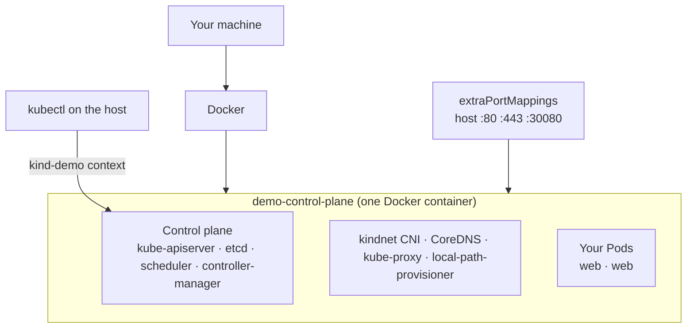

# Guide 3 — Single-Node Kubernetes Cluster Using Kind

**Kind** = *Kubernetes IN Docker*. Every Kubernetes node is a Docker container. Clusters start in 30–60 seconds and disappear just as fast, which makes Kind the best choice for CI pipelines, testing manifests, and disposable development clusters.

This guide creates **one node**. Kind can add worker containers with `role: worker`, but that is deliberately out of scope here.

---

## Pick your path

Each page below is complete on its own.

| Your situation | Page |
|---|---|
| Windows 11 with Docker Desktop | **[windows.md](./windows.md)** |
| Windows 11, working inside WSL2 | **[wsl2.md](./wsl2.md)** |
| Linux laptop/desktop | **[linux.md](./linux.md)** |
| macOS (Intel or Apple Silicon) | **[macos.md](./macos.md)** |
| One Ubuntu EC2 instance | **[single-ec2.md](./single-ec2.md)** |
| Something broke | **[troubleshooting.md](./troubleshooting.md)** |

Shared files: [`kind-config.yaml`](./kind-config.yaml) · [`manifests/`](./manifests/)

---

## Architecture

Kind nodes are Docker containers. In a single-node cluster there is exactly one container, and it runs both the control plane and your workloads.

```text
Laptop
└── Docker
    └── Kind control-plane container
        ├── Kubernetes control plane
        └── Application workloads
```



**Kind removes the control-plane taint automatically** on a single-node cluster, so your application Pods schedule immediately. That is the same problem the kubeadm guide solves manually with `kubectl taint nodes --all node-role.kubernetes.io/control-plane-` — Kind just does it for you.

The container is named `<CLUSTER_NAME>-control-plane`, and the kubectl context is `kind-<CLUSTER_NAME>`.

---

## What is inside the node container

Kind bootstraps with `kubeadm` inside the container, so a Kind node is a genuine Kubernetes node:

| Component | Notes |
|---|---|
| containerd | The node's container runtime — containers inside a container |
| kubelet | Runs as a systemd service inside the container |
| Control plane | Static Pods: `kube-apiserver`, `etcd`, `kube-scheduler`, `kube-controller-manager` |
| **kindnet** | Kind's built-in CNI. No CNI installation step needed. |
| CoreDNS, kube-proxy | Standard |
| **local-path-provisioner** | Provides a default StorageClass, so PersistentVolumeClaims work out of the box |

---

## The one thing that trips everyone up: networking

Kind nodes live on an internal Docker network (`kind`). **Nothing inside is reachable from your host unless you explicitly map a port at cluster-creation time.**

| To reach | How |
|---|---|
| The API server | Automatic — Kind writes the mapped port into your kubeconfig |
| A NodePort Service | `extraPortMappings` in the cluster config, **set before creating the cluster** |
| An Ingress | `extraPortMappings` for 80/443, plus the `ingress-ready=true` node label |
| Anything, without config | `kubectl port-forward` — always works |

> [!IMPORTANT]
> `extraPortMappings` **cannot be added to an existing cluster**. Adding one means deleting and recreating. With Kind that costs 40 seconds, so it is not the disaster it would be with kubeadm — but decide your ports before you create.

---

## Versions validated

Validated **2026-08-05**:

| Component | Version |
|---|---|
| Kind | v0.32.0 |
| Default node image | `kindest/node:v1.36.1` |
| Kubernetes | 1.36 |
| kubectl | 1.36.x |
| ingress-nginx (Kind provider) | controller-v1.15.1 |
| Sample image | `nginx:1.30-alpine` (multi-arch) |

> [!IMPORTANT]
> **Node images are tied to the Kind release.** `kindest/node:v1.36.1` built for Kind v0.32.0 is not necessarily the same image as one built for an older Kind. Always take the `@sha256` digest from the release notes of *your* Kind version:
> <https://github.com/kubernetes-sigs/kind/releases>
>
> Or simply omit `--image` and let Kind pick its own default — the safest option.

---

## Resource requirements

| Resource | Minimum | Recommended |
|----------|--------:|------------:|
| CPU | 2 cores | 4 cores |
| Memory free | 4 GB | 6–8 GB |
| Disk free | 15 GB | 25–30 GB |
| Nodes | 1 | 1 |

Kind is the lightest of the three local options — there is no VM layer on Linux, and on Windows/macOS it reuses Docker's existing VM.

---

## Kind vs the other guides

| | Kind | Minikube | kubeadm |
|---|---|---|---|
| Startup | ⭐ 30–60 s | 2–4 min | 15–25 min |
| Delete | ⭐ 5 s | 20 s | Messy |
| Add-ons | Manual (`kubectl apply`) | ⭐ `minikube addons enable` | Manual |
| Multi-cluster | ⭐ Trivial and cheap | Profiles | Painful |
| CI/CD | ⭐ Designed for it | Workable | No |
| Teaches internals | Low | Low | ⭐ High |
| Host networking | Needs `extraPortMappings` | Tunnels / direct on Linux | Direct |

Choose Kind when you want a cluster that is **fast to create and fast to throw away**.

---

## What you will do

1. Install Docker, `kubectl`, and `kind`
2. Create a basic single-node cluster (one command)
3. Recreate it with a config file that maps host ports
4. Install an ingress controller
5. Deploy and reach the sample application
6. Load a locally-built image without a registry
7. Delete the cluster

---

## Official documentation

- Kind quick start — <https://kind.sigs.k8s.io/docs/user/quick-start/>
- Configuration — <https://kind.sigs.k8s.io/docs/user/configuration/>
- Ingress — <https://kind.sigs.k8s.io/docs/user/ingress/>
- Loading images — <https://kind.sigs.k8s.io/docs/user/quick-start/#loading-an-image-into-your-cluster>
- Local registry — <https://kind.sigs.k8s.io/docs/user/local-registry/>
- Known issues — <https://kind.sigs.k8s.io/docs/user/known-issues/>
- Releases and node images — <https://github.com/kubernetes-sigs/kind/releases>
