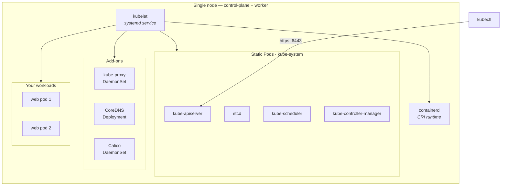

# Guide 1 — Single-Node Kubernetes Cluster Using kubeadm

Build a **real** Kubernetes cluster the way production clusters are built — with `kubeadm` and `containerd` — but on **one machine**. That machine is both the control-plane node and the worker node.

There is **no second machine**. There is **no `kubeadm join`**.

---

## Pick your path

Each page below is complete on its own. Read one, ignore the rest.

| Your situation | Page |
|---|---|
| I have a Linux laptop/desktop (Ubuntu/Debian) | **[local-linux.md](./local-linux.md)** |
| I have Windows 11 | **[wsl2.md](./wsl2.md)** |
| I have a Mac (Intel or Apple Silicon) | **[macos-ubuntu-vm.md](./macos-ubuntu-vm.md)** |
| I want it on one Ubuntu EC2 instance | **[single-ec2.md](./single-ec2.md)** |
| Something broke | **[troubleshooting.md](./troubleshooting.md)** |

Shared Kubernetes manifests live in [`manifests/`](./manifests/).

---

## Platform limitations — read this first

> [!IMPORTANT]
> **kubeadm requires Linux.** It configures Linux kernel modules, cgroups, iptables/nftables rules, and a systemd-managed `kubelet` service.
>
> - ❌ **kubeadm cannot run directly on native Windows.**
> - ❌ **kubeadm cannot run directly on native macOS.**
> - ✅ Windows → use **WSL2 with systemd enabled**, a local Ubuntu VM, or an Ubuntu EC2 instance.
> - ✅ macOS → use **one Ubuntu virtual machine** (Multipass, UTM, VMware Fusion, Parallels, VirtualBox where supported).
> - ℹ️ If you only want a working local cluster and don't care how it is bootstrapped, **[Minikube](../minikube/)** or **[Kind](../kind/)** is a far easier path on Windows and macOS.
> - ℹ️ **Docker Desktop's Kubernetes checkbox is not kubeadm.** It is a separate cluster with its own lifecycle. It teaches you nothing about bootstrapping and can hijack your `kubectl` context.

---

## Architecture you are building

```text
ONE Linux machine (laptop, WSL2 distro, Ubuntu VM, or EC2 instance)
│
├── containerd .................. container runtime (CRI)
├── kubelet ..................... node agent (systemd service)
│
├── Control-plane components (static Pods in kube-system)
│   ├── kube-apiserver
│   ├── etcd
│   ├── kube-scheduler
│   └── kube-controller-manager
│
├── kube-proxy .................. Service networking (DaemonSet)
├── CoreDNS ..................... cluster DNS (Deployment)
├── Calico ...................... CNI / Pod networking
│
└── YOUR APPLICATION PODS  ← only schedulable after the control-plane taint is removed
```



---

## Resource requirements

| Resource | Minimum | Recommended |
|----------|--------:|------------:|
| CPU | 2 cores | 4 cores |
| Memory | 4 GB | 6–8 GB |
| Disk | 25 GB | 40 GB |
| Nodes | 1 | 1 |

The 2-core minimum is enforced by `kubeadm init` — with fewer it fails a preflight check. The single node runs **both** the Kubernetes system components (roughly 1 vCPU and 1.5–2 GB just for the control plane, etcd, CoreDNS, and Calico) **and** all your application workloads. On the 4 GB minimum you have room for a handful of small Pods, not much more.

---

## Versions validated

Validated **2026-08-05** on Ubuntu 24.04 LTS:

| Component | Version |
|---|---|
| Kubernetes | 1.36 (`pkgs.k8s.io` `core:/stable:/v1.36`) |
| containerd | 2.3.x (`containerd.io` package from Docker's apt repo) |
| runc | bundled with `containerd.io` |
| CNI | Calico v3.32.1 |
| Sample image | `nginx:1.30-alpine` |

> [!WARNING]
> The old `apt.kubernetes.io` and `packages.cloud.google.com/apt` Kubernetes repositories are **retired and no longer served**. Any tutorial using them will fail. Every command in this guide uses `pkgs.k8s.io`, which is versioned per minor release.

---

## What you will do, in order

1. Prepare the host — hostname, swap off, kernel modules, sysctl
2. Install and configure **containerd** with `SystemdCgroup = true`
3. Install **kubeadm**, **kubelet**, **kubectl** from `pkgs.k8s.io`
4. Run **`kubeadm init`** with a Pod CIDR
5. Configure **kubeconfig** for your regular user
6. Install the **Calico CNI** — the node stays `NotReady` until you do
7. **Remove the control-plane taint** so Pods can schedule on the only node
8. **Verify** the cluster
9. **Deploy** the sample application and reach it
10. **Reset / clean up**

---

## Key concepts referenced throughout

**CRI (Container Runtime Interface)** — the gRPC API the kubelet uses to talk to a container runtime. containerd implements it via its built-in CRI plugin, exposed on the socket `unix:///run/containerd/containerd.sock`.

**Docker vs containerd** — Docker Engine is a developer-facing toolkit (build, CLI, networking, compose) that itself runs on containerd. Kubernetes removed direct Docker support in v1.24; the kubelet now speaks CRI. Using containerd directly means one less moving part. You can still build images with Docker elsewhere and run them here.

**cgroups and the cgroup driver** — cgroups (control groups) are the Linux kernel feature that enforces CPU and memory limits. On a systemd host, systemd owns the cgroup hierarchy, so **both** the kubelet and containerd must use the `systemd` cgroup driver. If they disagree, the kubelet and containerd fight over the hierarchy and Pods become unstable under memory pressure. Kubernetes 1.36 defaults the kubelet to `systemd`; you must set `SystemdCgroup = true` in containerd to match.

**Taints and tolerations** — a taint on a node repels Pods that do not carry a matching toleration. `kubeadm` taints the control-plane node with `node-role.kubernetes.io/control-plane:NoSchedule` so ordinary workloads never compete with etcd and the API server. On a single-node cluster that would leave nowhere to run your app, so you remove it.

**Pod CIDR** — the IP range Pods get addresses from. It must not overlap your host/LAN/VPC network, and it must match what the CNI expects. This guide uses `192.168.0.0/16` (Calico's default). **If your home LAN or VPC uses `192.168.x.x`, use `10.244.0.0/16` instead** — each page tells you how.

---

## Official documentation

- Installing kubeadm — <https://kubernetes.io/docs/setup/production-environment/tools/kubeadm/install-kubeadm/>
- Creating a cluster with kubeadm — <https://kubernetes.io/docs/setup/production-environment/tools/kubeadm/create-cluster-kubeadm/>
- Container runtimes — <https://kubernetes.io/docs/setup/production-environment/container-runtimes/>
- Ports and protocols — <https://kubernetes.io/docs/reference/networking/ports-and-protocols/>
- Calico on Kubernetes — <https://docs.tigera.io/calico/latest/getting-started/kubernetes/quickstart>
- Taints and tolerations — <https://kubernetes.io/docs/concepts/scheduling-eviction/taint-and-toleration/>
