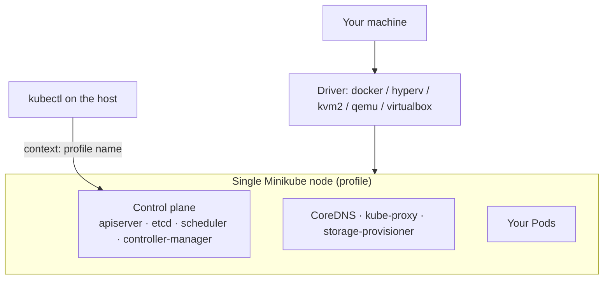

# Guide 2 — Single-Node Kubernetes Cluster Using Minikube

Minikube runs a **complete, real** Kubernetes cluster inside one VM or one container on your machine. It is the friendliest way to get a local cluster: one command, and you have a working control plane, CoreDNS, a storage provisioner, and a default StorageClass.

This guide creates **one node**. Minikube can do multi-node (`--nodes=N`), but that is deliberately out of scope here.

---

## Pick your path

Each page below is complete on its own.

| Your situation | Page |
|---|---|
| Windows 11 with Docker Desktop or Hyper-V | **[windows.md](./windows.md)** |
| Windows 11, working inside WSL2 | **[wsl2.md](./wsl2.md)** |
| Linux laptop/desktop | **[linux.md](./linux.md)** |
| macOS (Intel or Apple Silicon) | **[macos.md](./macos.md)** |
| One Ubuntu EC2 instance | **[single-ec2.md](./single-ec2.md)** |
| Something broke | **[troubleshooting.md](./troubleshooting.md)** |

Shared manifests: [`manifests/`](./manifests/).

---

## Architecture

```text
Your machine (laptop or EC2 instance)
└── Driver (Docker / Hyper-V / KVM2 / QEMU / VirtualBox)
    └── ONE Minikube node
        ├── kubelet + container runtime
        ├── Control plane: kube-apiserver, etcd, scheduler, controller-manager
        ├── CoreDNS, kube-proxy, storage-provisioner
        └── YOUR APPLICATION PODS
```



Unlike kubeadm, Minikube does **not** taint the node — your workloads schedule immediately.

---

## Driver choice by platform

The **driver** is how Minikube creates the node: a container, or a VM.

| Platform | Primary driver | Alternatives |
|---|---|---|
| Windows + Docker Desktop | `docker` ⭐ | `hyperv`, `virtualbox` |
| Windows + WSL2 | `docker` (via Docker Desktop WSL integration or Docker Engine in WSL) ⭐ | — |
| Linux | `docker` ⭐ | `kvm2`, `none`, `podman`, `virtualbox` |
| macOS Intel | `docker` ⭐ | `qemu`, `hyperkit` (deprecated), `virtualbox` |
| macOS Apple Silicon | `docker` (Docker Desktop or Colima) ⭐ | `qemu` |
| Ubuntu EC2 | `docker` ⭐ | (no VM drivers — nested virtualization is not available) |

**Docker is the primary cross-platform driver** and what every page here uses by default: fastest startup, lowest overhead, and it behaves the same everywhere.

| Driver | How it works | Trade-off |
|---|---|---|
| `docker` | The node is a Docker container | Fastest; shares the host kernel; needs Docker |
| `hyperv` | A Hyper-V VM (Windows Pro/Enterprise) | Real VM isolation; conflicts with VirtualBox; needs admin |
| `kvm2` | A KVM VM (Linux) | Real VM; good performance on Linux; needs `libvirt` |
| `qemu` | A QEMU VM | Works on Apple Silicon without Docker; slower |
| `virtualbox` | A VirtualBox VM | Portable; poor on Apple Silicon; conflicts with Hyper-V |
| `podman` | Rootless container (Linux) | Docker alternative; some rough edges |
| `none` | Runs directly on the host, no isolation | Linux + root only. Fast but pollutes the host — the EC2 page explains why to avoid it |

**Colima** (macOS) is not a Minikube driver — it is a Docker-compatible runtime. Start Colima, and Minikube's `docker` driver uses it.

---

## Versions validated

Validated **2026-08-05**:

| Component | Version |
|---|---|
| Minikube | v1.38.1 |
| Kubernetes (Minikube default) | 1.36.x |
| kubectl | 1.36.x |
| Docker Engine / Docker Desktop | current release |
| Sample image | `nginx:1.30-alpine` (multi-arch) |

Check the current Minikube release at <https://github.com/kubernetes/minikube/releases>.

---

## Resource requirements

| Resource | Minimum | Recommended |
|----------|--------:|------------:|
| CPU | 2 cores | 4 cores |
| Memory | 4 GB free | 6–8 GB free |
| Disk | 20 GB free | 30–40 GB free |
| Nodes | 1 | 1 |

Minikube itself enforces a 2-CPU / ~1.8 GB floor.

---

## Minikube vs the other guides

| | Minikube | Kind | kubeadm |
|---|---|---|---|
| Startup | 2–4 min | 30–60 s | 15–25 min |
| Batteries included | ⭐ Add-ons, StorageClass, LoadBalancer via tunnel | Minimal | None |
| Teaches internals | Low | Low | ⭐ High |
| Best for | Everyday local development | CI and disposable clusters | Learning how clusters are built |

Choose Minikube when you want a local cluster that behaves like a real one with the least effort — and add-ons like Ingress, metrics-server, and the dashboard available as one-liners.

---

## What you will do

1. Install Docker (or another driver), `kubectl`, and `minikube`
2. `minikube start` with an explicit profile and resources
3. Verify the single node
4. Enable only the add-ons you need
5. Deploy and reach the sample application
6. Build and load a local image without a registry
7. Stop, pause, or delete the cluster

---

## Official documentation

- Minikube docs — <https://minikube.sigs.k8s.io/docs/>
- Start guide — <https://minikube.sigs.k8s.io/docs/start/>
- Drivers — <https://minikube.sigs.k8s.io/docs/drivers/>
- Add-ons — <https://minikube.sigs.k8s.io/docs/handbook/addons/>
- Accessing apps — <https://minikube.sigs.k8s.io/docs/handbook/accessing/>
- Pushing images — <https://minikube.sigs.k8s.io/docs/handbook/pushing/>
